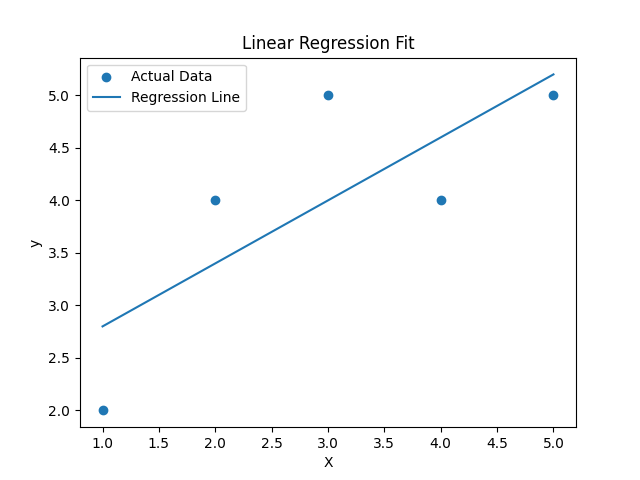
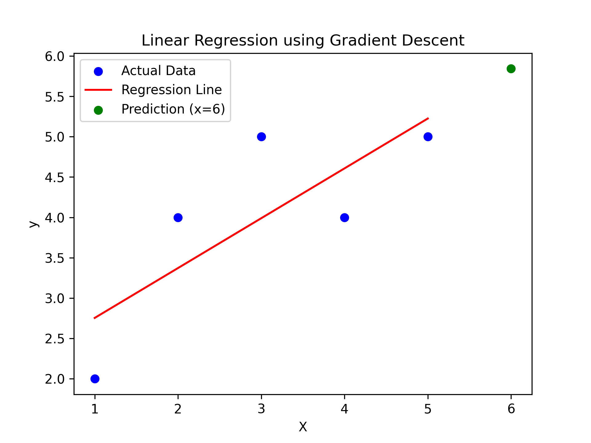

# Linear Regression From Scratch (Python)

## This project implements Linear Regression from scratch using Python without relying on machine learning libraries such as Scikit-Learn.

## The purpose of this project is to understand the mathematical foundations and optimization techniques behind linear regression.

## The project contains two implementations.

### Closed Form Linear Regression which calculates weight and bias directly using mathematical formulas.

### Gradient Descent Linear Regression which iteratively updates the model parameters using Mean Squared Error.

# Introduction

## Linear Regression is one of the most fundamental algorithms in machine learning and statistics.

## It is widely used to predict continuous numerical values such as house prices, sales revenue, stock prices, or exam scores.

## The main objective of linear regression is to find the best fitting straight line that represents the relationship between input and output variables.

## The algorithm tries to minimize the difference between predicted values and actual values.

# What is Linear Regression

## Linear Regression is a supervised learning algorithm used to model the relationship between a dependent variable and one or more independent variables.

## The algorithm assumes that there is a linear relationship between the input feature and the output variable.

## The model learns the relationship by fitting a straight line that best represents the dataset.

## Linear regression is widely used in many domains such as economics, finance, marketing, and data science.

# Mathematical Representation

## The equation of a simple linear regression model is:

### y = wx + b

## In this equation x represents the input feature.

## In this equation y represents the predicted output.

## The parameter w represents the weight or slope of the regression line.

## The parameter b represents the bias or intercept which shifts the line up or down.

## The goal of the model is to learn the optimal values of w and b.

# Example 1: House Price Prediction

## Suppose we want to predict house prices based on house size.

## Example dataset:

### 1000 sq ft → 200

### 1200 sq ft → 240

### 1500 sq ft → 300

### 1800 sq ft → 360

## A linear regression model may learn the relationship:

### price = 0.2 × size

## If a house size is 1600 sq ft.

### predicted price = 0.2 × 1600

### predicted price = 320

# Example 2: Study Hours vs Exam Score

## Suppose we want to predict exam scores based on study hours.

## Example dataset:

### 1 hour → 40

### 2 hours → 50

### 3 hours → 60

### 4 hours → 70

## The model might learn the relationship:

### score = 10 × hours + 30

## If a student studies 5 hours.

### predicted score = 10 × 5 + 30

### predicted score = 80

# Closed Form Linear Regression

## Closed form linear regression calculates the optimal weight and bias directly using statistical formulas.

## The weight is calculated using the covariance between x and y divided by the variance of x.

## The formula for weight is:

### w = Σ(x − x̄)(y − ȳ) / Σ(x − x̄)²

## The bias is calculated using the mean of the variables.

### b = ȳ − w × x̄

## Where x̄ represents the mean of input values.

## Where ȳ represents the mean of output values.

## This method directly computes the regression line without iterative training.

# Closed Form Linear Regression Visualization

## The following figure shows the regression line learned using the closed form solution.

# Gradient Descent Linear Regression

## Gradient Descent is an optimization algorithm used to minimize the error of the model.

## Instead of directly computing the parameters the algorithm updates them iteratively.

## The algorithm gradually improves the parameters until the error becomes minimal.

## Gradient descent is widely used in modern machine learning and deep learning models.

# Steps in Gradient Descent

## Initialize weight and bias with starting values.

## Compute predictions using the linear regression equation.

## Calculate the loss value.

## Compute gradients for weight and bias.

## Update weight and bias using the gradients.

## Repeat the process for multiple iterations until convergence.

# Mean Squared Error (MSE)

## Mean Squared Error is a common loss function used for regression models.

## It measures the average squared difference between predicted values and actual values.

## The formula for MSE is:

### MSE = (1 / n) Σ (y − ŷ)²

## In this equation y represents the actual value.

## In this equation ŷ represents the predicted value.

## In this equation n represents the number of samples.

## The objective of the model is to minimize the MSE value.

# Gradient Update Equations

## During gradient descent the parameters are updated using gradient formulas.

## The weight update equation is:

### w = w − α(−2/n Σ x(y − ŷ))

## The bias update equation is:

### b = b − α(−2/n Σ (y − ŷ))

## In these equations α represents the learning rate.

## The learning rate controls the step size during optimization.

# Gradient Descent Linear Regression Visualization

## The following figure shows the regression line learned using gradient descent optimization.

# Machine Learning Pipeline

## In professional machine learning systems models are developed using a structured pipeline.

## A machine learning pipeline improves maintainability and scalability.

# Step 1 Data Loading

## The first step is to load the dataset from files, databases, or APIs.

# Step 2 Data Preprocessing

## Data preprocessing prepares the dataset for training.

## Common preprocessing steps include handling missing values and feature scaling.

# Step 3 Model Training

## The regression model is trained using the training dataset.

# Step 4 Prediction

## The trained model is used to generate predictions for new input data.

# Step 5 Model Evaluation

## The performance of the model is evaluated using metrics such as Mean Squared Error.

# Project Structure

## A clean project structure helps maintain readability and scalability.

### linear-regression-from-scratch/

### data/

### src/

### notebooks/

### tests/

### main.py

### requirements.txt

### README.md

# Running the Project

## Clone the repository using git.

## Navigate to the project directory.

## Run the main Python file to train and test the model.

# Future Improvements

## Implement multiple linear regression.

## Add visualization of regression line.

## Implement additional evaluation metrics such as R² score.

## Compare results with Scikit-Learn implementation.

## Add experiment tracking using MLflow.

# Conclusion

## This project demonstrates how linear regression works internally by implementing it from scratch.

## Understanding these internal mechanics builds strong intuition about machine learning algorithms.

## This project also follows a modular structure similar to professional machine learning pipelines used in industry.